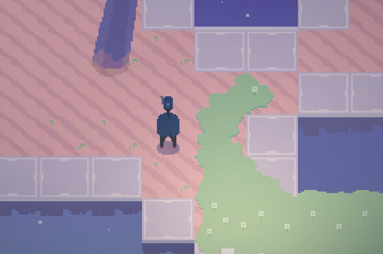

## Overview

Blind Jump is a procedurally generated space adventure game that I've been working on off and on in my free time. The object of the game is to get to the teleporter at the end of each level, while battling monsters and evil robots.

<p align="center"></p>

## Installation

This project uses make and makedepend as a build system. Currently, the game is available on Unix-like systems, but it uses cross-platform libraries and could easily be ported (uses SFML 2.3, required to compile project). In bash:

Resolve dependencies
```bash
make depend
```

Compile (macOS)
```bash
make macOS
```
This will create a .app package in the prod folder.

Compile (Linux)
```bash
make Linux
```
This places an executable in the src folder. It looks for resource files in ../Resources, so don't move it!

## Bugs

Please report any bugs that you find. I want the application to feel well polished, so if there are any legitiment runtime issues I'd appreciate being notified of them. The only one I know of currently: the mac version of the game issues a crash report when returning from main, due to bad access when attempting to call some destructors. Any ideas?
